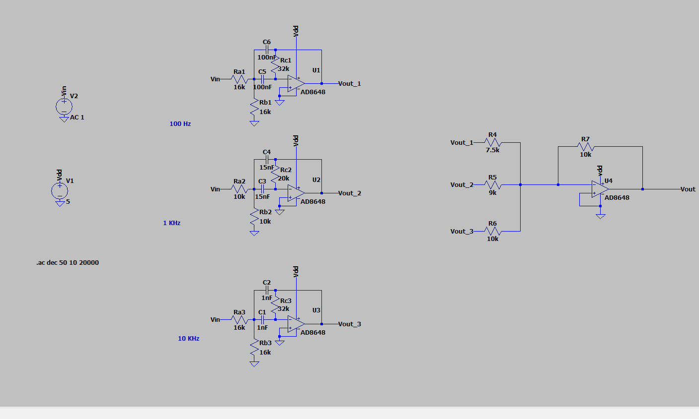

# 🎚️ Analog Graphic Equalizer

Design and implementation of a 3-band analog graphic equalizer using active band-pass filters, op-amps, a sinusoidal oscillator for test signal generation, LTspice simulation, MATLAB Bode analysis, and hardware validation.

## 📌 Overview
This project presents the design and implementation of a 3-band analog graphic equalizer. The system allows independent control of low, mid, and high frequency audio bands using active band-pass filters.

A sinusoidal oscillator is designed and used as the input signal source to verify the frequency-selective behavior of the equalizer.

## 🧩 System Architecture
The complete analog graphic equalizer system consists of the following stages:

1. Sinusoidal oscillator (signal generation)
2. Active band-pass filter – 100 Hz (low-frequency band)
3. Active band-pass filter – 1 kHz (mid-frequency band)
4. Active band-pass filter – 10 kHz (high-frequency band)
5. Summing amplifier (adder circuit)

## 🔊 Sinusoidal Oscillator
A sinusoidal oscillator is designed to generate a clean sine wave that acts as the input signal for the equalizer.

- Purpose: Test signal generation
- Output waveform: Sinusoidal
- Benefit: Enables independent testing without external function generator

## 🎛️ Band-Pass Filter Design
Each frequency band is implemented using an active band-pass filter designed with operational amplifiers.

| Band | Center Frequency |
|-----|------------------|
| Low | 100 Hz |
| Mid | 1 kHz |
| High | 10 kHz |

Component values were calculated using standard band-pass filter design equations and verified through simulation.

## 🧪 Simulation & Analysis
- LTspice used for circuit simulation
- AC analysis performed to obtain Bode plots
- Individual and combined frequency responses verified
- MATLAB used for magnitude response plotting
- ### Bode Plot (AC Analysis)

### LTspice Schematic

MATLAB was used for analysis and plotting of frequency response data obtained from LTspice simulations.

## 🔌 Hardware Implementation
The complete circuit was implemented on a breadboard using discrete components and operational amplifiers.
The oscillator output and equalizer response were observed using a CRO to verify sinusoidal behavior and frequency response.

## 📊 Results
- Individual band-pass filter responses verified
- Combined equalizer output obtained using adder circuit
- Expected frequency boosting and attenuation observed

## 🛠️ Tools Used
- LTspice
- MATLAB
- Operational amplifiers
- CRO and power supply
- Passive components (R, C)

##  Author
- Divyansh Verma

- ## 📄 Documentation
Detailed calculations, derivations, simulation results, and hardware images are available in the Documentation folder.
